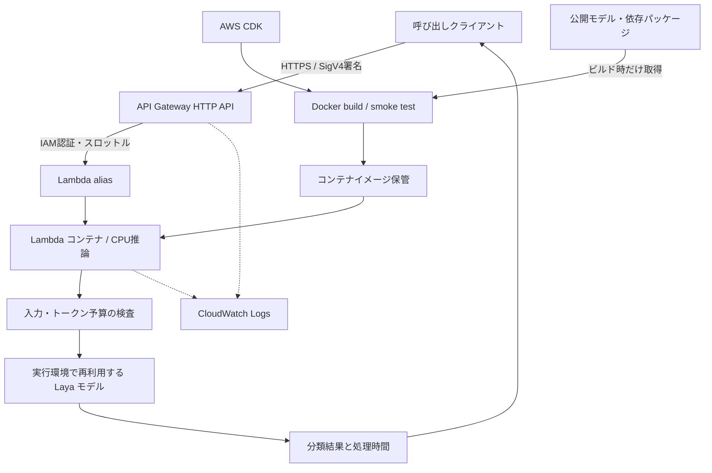

# Laya on AWS Lambda × API Gateway

日本語テキストの分類・段階評価・Yes/No判定を、LayaのPython SDKで実行する検証用サンプルです。AWS CDKでIAM認証付きHTTP APIと推論用Lambdaコンテナを構築します。

**検証の結論：初期化後は短い商品レビューを中央値約245msで判定できましたが、感情3分類の正答率は56.0%でした。通常起動では初期化タイムアウトも発生しました。**

## 検証結果のサマリー

[HTMLレポート](docs/report.html)では、速度の比較、感情分類の混同行列、誤判定例、検索・絞り込み可能な全100件の結果を読めます。ダウンロードしてブラウザーで開いてください。外部通信は不要です。

| 検証 | 内容 | 結果 | 詳細 |
|---|---|---|---|
| 商品レビューの感情分類 | 架空の日本語レビュー100件を肯定・中立・否定に分類 | **56/100件正解（56.0%）、Macro-F1 0.525** | [評価レポート](docs/benchmarks/product-review-sentiment/README.md) / [全100件](docs/benchmarks/product-review-sentiment/RESULTS.md) |
| レビューの応答時間 | 初期化・ウォームアップ後、1件1問、逐次100回 | API応答中央値 **245.49ms**、p95 **328.65ms**、100回成功 | 同上 |
| 問い合わせの分類精度 | 合成日本語60件×8項目 | 275/480判定正解（57.3%）、8項目の完全一致3/60件 | [問い合わせ精度](ACCURACY_VALIDATION.md) |
| 文章長・質問数と速度 | 3文章長×1/3/8問×30回 | 初期化後270/270回成功。中央値175.8〜4,325.1ms | [速度検証](SPEED_VALIDATION.md) |
| 通常起動 | 初回と再呼び出し3回 | 4回とも推論結果を取得できずタイムアウト | [速度検証](SPEED_VALIDATION.md) |
| 初期化の観測 | 一時的なProvisioned Concurrencyで事前初期化 | 約96秒。上記の通常起動とは別条件で測定 | [速度検証](SPEED_VALIDATION.md) |

商品レビューでは否定33件は全件正解でしたが、肯定・中立の30件も否定と判定しました。合成データに対する成績であり、実レビューの分布を代表しません。期待値は推論前に固定し、別のAIで確認しましたが、独立した人手評価は行っていません。

レイテンシーは通信を含むクライアント計測です。初期化・ウォームアップを除外しており、初回アクセスや並列負荷の応答保証ではありません。公開しない環境条件もあるため、同じ速度の再現は保証できません。

## 構成図



- `POST /predict`：本文と質問を受け取り、`choice`、`score`、`noul`形式で判定します。
- `GET /health`：モデルロード後に状態を返します。初期化前に応答できる軽量ヘルスチェックではありません。
- 両ルートにAWS IAM認証を適用します。エンドポイントはインターネットから到達可能であり、ネットワーク上のPrivate APIではありません。
- モデルとtokenizerは固定commitからビルド時に取得し、イメージへ同梱します。実行時のモデルダウンロードは行いません。
- Lambdaの権限は対象ロググループへの書込みに限定しています。リクエスト本文、判定結果、署名ヘッダーをアプリログに記録しません。

## 一般的な導入手順

この手順は各自のAWS環境で使用するものです。`YOUR_PROFILE`、`YOUR_REGION`は自分の設定に置き換えてください。

### 1. 前提を用意する

- Python 3.12、CDKが対応するNode.js、AWS CLI v2、Linuxコンテナ用のDocker / Buildx。
- 短期認証を使うAWSプロファイル。IAM Identity Center等の組織の認証方式に従って設定します。
- デプロイ先への必要な権限。デプロイ用権限とAPI呼び出し専用の権限を分けます。
- Dockerビルドでは公開モデルと依存パッケージを取得するため、ネットワーク、ストレージ、メモリを確保します。

PowerShellの例です。コマンドはリポジトリ直下で実行します。

```powershell
py -3.12 -m venv .venv
.\.venv\Scripts\python.exe -m pip install -r requirements-dev.txt
npm ci

$env:AWS_PROFILE = 'YOUR_PROFILE'
$env:AWS_DEFAULT_REGION = 'YOUR_REGION'
$env:AWS_REGION = $env:AWS_DEFAULT_REGION
$env:PYTHONUTF8 = '1'
$env:BUILDX_NO_DEFAULT_ATTESTATIONS = '1'
$cdkApp = '.venv\Scripts\python.exe app.py'

# IAM Identity Centerを利用する場合
aws sso login --profile $env:AWS_PROFILE
```

macOS / Linuxでは`python3.12 -m venv .venv`を使用し、Pythonのパスを`.venv/bin/python`、環境変数の設定を`export`に置き換えます。CDK CLIは`package-lock.json`で固定しています。

### 2. テストと差分を確認する

```powershell
.\.venv\Scripts\python.exe -m pytest -q
npx cdk synth --quiet --app $cdkApp
npx cdk diff --no-change-set --app $cdkApp
```

ローカルで対象アカウント・リージョンとIAM変更を確認してください。`cdk.out/`、差分の出力、ビルドログは非公開情報を含み得ます。Dockerビルドには依存関係検査と、非root・モデル読取り専用・Pythonソケット接続禁止の実モデルsmoke testを組み込んでいます。

### 3. デプロイする

```powershell
# 対象アカウント・リージョンで初回のみ。共有bootstrap資源を作成します
npx cdk bootstrap --app $cdkApp

# bootstrap後に変更セットを使った差分も確認します
npx cdk diff --app $cdkApp

# 差分とIAM権限の確認を省略しません
npx cdk deploy --app $cdkApp --outputs-file cdk-outputs.json
```

`cdk-outputs.json`は自分の環境専用です。公開しないでください。デプロイ成功は初回推論の成功を意味しません。既定のオンデマンド構成では、検証時に初期化タイムアウトが発生しています。

初期化後の挙動を再検証する場合は、Provisioned Concurrencyを有効にして初期化完了を待つ方法があります。

```powershell
npx cdk deploy --app $cdkApp -c provisionedConcurrency=1 --outputs-file cdk-outputs.json
```

Provisioned Concurrencyには待機中も料金がかかります。単発の検証後は0へ戻してください。既定値以上の同時要求が流れた場合のコールドスタートも防ぐ保証はありません。

### 4. APIを呼び出す

```powershell
.\.venv\Scripts\python.exe scripts/invoke.py --request examples/request.json --path /predict
.\.venv\Scripts\python.exe scripts/invoke.py --path /health
```

呼び出しスクリプトは標準のexecute-api HTTPSエンドポイントと許可ルートを確認してから署名します。カスタムドメインには対応していません。呼び出しに必要な最小ポリシーは`print_invoke_policy.py`で生成できますが、生成結果には自分の環境のARNが入るため非公開で管理してください。

モデルへ送るJSONの例です。

```json
{
  "state": "軽くて持ちやすく、毎日の通勤で役立っています。",
  "questions": {
    "sentiment": {
      "type": "choice",
      "instructions": "商品レビューの全体的な感情を選んでください。",
      "criteria": {
        "positive": "肯定的",
        "neutral": "中立",
        "negative": "否定的"
      }
    }
  }
}
```

これは使い方の簡略例です。感情検証で実際に使った質問は[question.json](docs/benchmarks/product-review-sentiment/data/question.json)に保存しています。

### 5. 検証と片付け

商品レビューの評価方法、100件の問題、全判定、再集計手順は[詳細レポート](docs/benchmarks/product-review-sentiment/README.md)を参照してください。評価スクリプトは既存のProvisioned Concurrencyを上書きしないため、上の手順で有効にした場合は先に0へ戻してください。評価スクリプト自身が一時設定と解除を行います。

```powershell
# 一時的なProvisioned Concurrencyを戻す
npx cdk deploy --app $cdkApp -c provisionedConcurrency=0 --outputs-file cdk-outputs.json

# 検証用スタックが不要になった場合だけ実行
npx cdk destroy --app $cdkApp
```

既定ではスタック削除時にログも削除されます。必要な監査記録は非公開の保管先へ退避してください。CDK bootstrap用の共有資源やECR資産が残る場合があります。共有bootstrapスタックを無条件に削除しないでください。

## 入力制限と設定

| 項目 | ソースの既定値・制約 |
|---|---|
| HTTP本文 | デコード後64KiBまで、JSONのみ |
| state | 12,000文字まで。別途token数を検査 |
| 質問 | 1〜8個、choiceは2〜20候補、scoreは2〜10段階 |
| token予算 | 全体1,024、質問側384。切り捨てが必要な入力は422 |
| Lambda / API統合timeout | 28秒 / 29秒 |
| メモリ / 予約同時実行 | 8,192MB / 2。最適値を保証するものではない |
| Provisioned Concurrency | 0。contextで変更可能 |
| ログ | 保持7日、スタック削除時に削除 |

変更可能なcontextは[cdk.json](cdk.json)と[設定検証](infra/config.py)を参照してください。主要なエラーは400（不正入力）、413（サイズ超過）、415（Content-Type）、422（token予算）、403（IAM認証・認可）、429/5xx（制限・実行失敗）です。

## 参考資料

- [Laya](https://github.com/NandhaKishorM/laya)
- [AWS Lambdaのベストプラクティス](https://docs.aws.amazon.com/lambda/latest/dg/best-practices.html)
- [HTTP APIのIAM認証](https://docs.aws.amazon.com/apigateway/latest/developerguide/http-api-access-control-iam.html)
- [Lambdaの実行環境と初期化](https://docs.aws.amazon.com/lambda/latest/dg/lambda-runtime-environment.html)
- [Lambdaコンテナイメージ](https://docs.aws.amazon.com/lambda/latest/dg/images-create.html)
